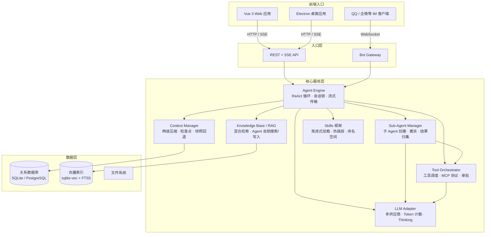

# GuaDa — 桌面 AI 工作站

> 看得见、摸得着、能动手的桌面 AI 工作站。基于 ReAct Agent + 子 Agent 分层架构，集成浏览器自动化、RAG 知识库、IM 机器人、MCP 工具与 Skills 技能框架，一个引擎统一服务 Web / 桌面 / IM 三大入口。

[](https://nestjs.com)
[](https://vuejs.org)
[](https://www.typescriptlang.org)
[](https://www.prisma.io)
[](LICENSE)

中文 | [English](README.en.md)

---

## 项目仓库

- **GitCode**: https://atomgit.com/donggua_sherlock/GuaDaAI
- **GitHub**: https://github.com/donggua-zen/guada
- **Gitee**: https://gitee.com/zhendongdong/guada_ai

---

遇到问题、意见建议、技术交流或者下载预编译的客户端请加：
- QQ群：1047993501
- 公众号：冬瓜编程实验室

---

## 什么是 GuaDa？

GuaDa 是一个**桌面 AI 工作站**——一句话：把 AI 请到你的电脑里，帮你干活。

- **如果你做新媒体（运营/文案/编导）** → 写脚本、出文案、追热点，Agent 还能定时抓取竞品动态、自动整理素材库，打开浏览器帮你爬数据
- **如果你是程序员** → 分析代码、写技术方案、审 PR，丢一个项目进知识库，随时问不用重新读，写脚本的事交给 Agent 自动完成
- **如果你是作者/编剧** → 构思人物、搭建世界观、头脑风暴情节，GuaDa 记得住你的设定，不会"忘记前面说过什么"
- **如果你是团队/企业** → 搭一个内部 AI 客服，绑定知识库，员工问问题 AI 自动答，还能接入 QQ/企业微信

自己用免费，团队用可控（数据不出本机），开箱即用不用折腾。

---

## 核心能力

| 能力 | 说明 | 文档 |
|------|------|------|
| **智能体（Agent）** | 基于 ReAct 模式的多轮自治循环 + 子 Agent 分层委派，支持会话锁、流式传输、中断处理与再生模式 | [→ 详情](docs/agent-engine.md) |
| **子 Agent 系统** | 主 Agent 将复杂任务拆解并委派给子 Agent 独立执行，专属会话/工具/LLM，结果自动归集 | [→ 详情](docs/sub-agent.md) |
| **知识库 (RAG)** | 语义+关键词双重混合检索，Agent 自助多轮搜索与文档写入，支持 40+ 格式 | [→ 详情](docs/knowledge-base.md) |
| **长期记忆** | 两级压缩策略（裁剪工具结果→语义压缩），可编辑、可回退、有历史，非破坏性压缩 | [→ 详情](docs/memory.md) |
| **技能管理** | 文件即技能，热插拔即时生效，渐进式加载节省 Token，兼容 Skills 市场生态 | [→ 详情](docs/skills.md) |
| **定时任务管理** | Agent 按 Cron 或固定周期自动执行，可绑定角色配置，独立会话隔离，完整执行记录 | [→ 详情](docs/scheduler.md) |
| **Bot 网关** | 统一接入 QQ/企业微信等 IM 平台，自动重连、消息合并、会话映射，动态启停 | [→ 详情](docs/bot-gateway.md) |
| **浏览器自动化** | Electron 内嵌 Chromium，Agent 直接操控浏览器。特色 6 层智能压缩，将页面 DOM 蒸馏为极简选择器树，实测省 70%+ Token 且不丢结构信息 | [→ 详情](docs/browser-automation.md) |
| **多模型管理** | 统一适配 OpenAI/Anthropic/Azure/Google 等供应商，角色级/会话级/全局级多层级配置 | [→ 详情](docs/models.md) |
| **多部署方式** | 支持 Electron 桌面端、Web 应用、Docker 容器化三种部署方式 | [→ 部署指南](#部署) |
| **企业级数据支持** | 默认 SQLite，通过 Prisma ORM 可无缝切换 MySQL、PostgreSQL | — |
| **自定义壁纸** | 自定义背景壁纸、透明度、毛玻璃效果，打造个性化工作站 | — |

### 产品截图

|  |  |
|:---:|:---:|
|  |  |
|  |  |
|  |  |

---

## 整体架构




### 架构层次

| 层级 | 职责 | 核心组件 |
|------|------|----------|
| **前端入口** | 用户交互层：Web 应用、Electron 桌面、IM 客户端 | Vue 3、Electron、QQ/企业微信 Bot |
| **入口层** | 请求路由与协议转换 | REST + SSE API、Bot Gateway |
| **核心服务层** | Agent 引擎统一调度对话、知识检索、工具调用、子 Agent 委派 | Agent Engine、Sub-Agent Manager、上下文压缩、RAG、工具与 MCP、Skills 框架、LLM 适配器 |
| **数据层** | 持久化存储 | SQLite（Prisma ORM，可切换 MySQL/PostgreSQL）、sqlite-vec + FTS5、文件系统 |

---

## 部署

| 方式 | 文档 |
|------|------|
| **Docker（推荐）** | [部署指南](docs/DOCKER_DEPLOYMENT.md) — `cp .env.example .env && ./deploy.sh` 一键部署 |
| **Web 传统部署** | [生产环境指南](docs/PRODUCTION_DEPLOYMENT.md) — 构建 + PM2 + Nginx + HTTPS |
| **Electron 桌面端** | [Electron 指南](docs/ELECTRON_DEPLOYMENT.md) — 开发、打包、更新 |

---

## 项目结构

```
ai_chat/
├── backend-ts/                  # NestJS 后端
│   ├── prisma/schema.prisma     # 数据库 Schema
│   ├── src/
│   │   ├── common/              # 基础设施（数据库、向量、MCP、工具函数）
│   │   ├── modules/
│   │   │   ├── chat/            # 核心对话（Agent 引擎、压缩、上下文、审批）
│   │   │   ├── tools/           # 工具调用系统（调度、MCP、上下文）
│   │   │   ├── skills/          # Skills 技能框架
│   │   │   ├── sub-agent/       # 子 Agent 系统
│   │   │   ├── knowledge-base/  # 知识库（RAG）
│   │   │   ├── llm-core/        # LLM 适配层
│   │   │   ├── bot-gateway/     # 机器人网关
│   │   │   ├── characters/      # 角色管理
│   │   │   ├── scheduler/       # 定时任务
│   │   │   └── ...              # auth、files、models、settings、users、mcp-servers
│   │   └── main.ts
│   └── skills/                  # 技能目录
├── frontend/                    # Vue 3 前端（组件、composables、stores、services）
├── electron/                    # Electron 桌面端
├── docs/                        # 文档
└── LICENSE
```

---

## 开发计划

| 功能 | 状态 | 说明 |
|------|------|------|
| **子 Agent 系统** | ✅ 已完成 | 分层 Agent 体系，复杂任务自动拆解分发至子 Agent 独立执行，结果归集 |
| **Agent 工作流** | ✅ 已完成 | 多步骤 Agent 编排，通过子 Agent 实现任务拆解与协作 |
| **子账户** | 🚧 后端完成 | 数据隔离、配置共享，适合家庭 / 团队共享使用 |
| **沙箱** | 📝 规划中 | 安全的代码执行环境，Agent 可编写并运行脚本 |
| **Agent 工作流可视化** | 📝 规划中 | 图形化展示 Agent 推理、工具调用、子 Agent 执行链 |

---

## 许可证

本项目基于 [MIT License](LICENSE) 开源。

---
