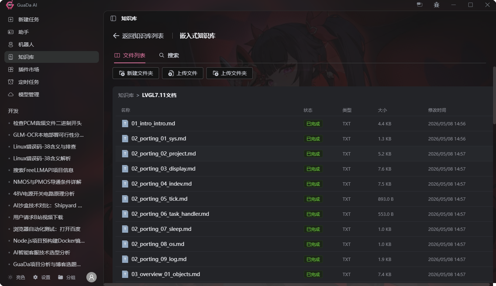
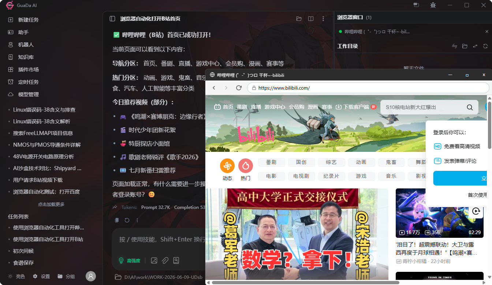
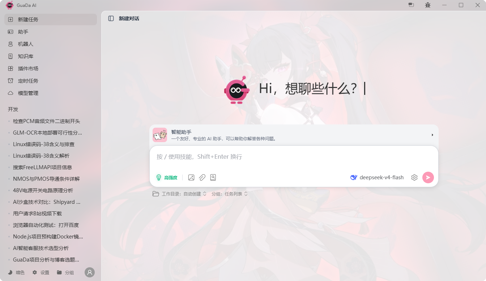
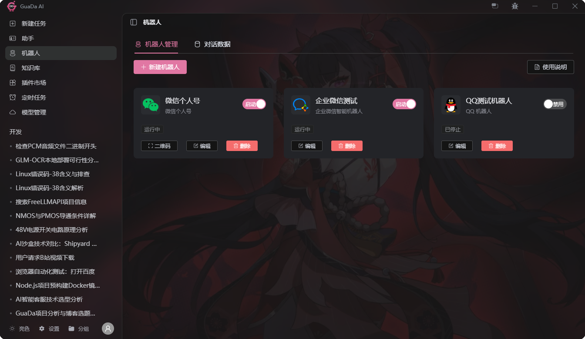
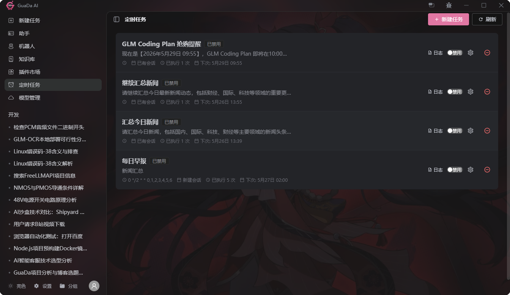
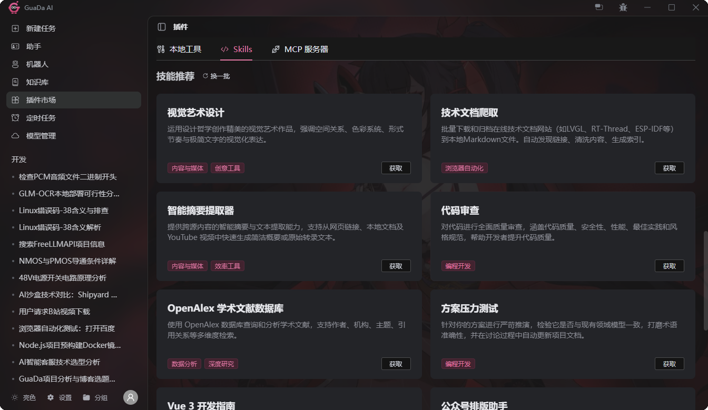
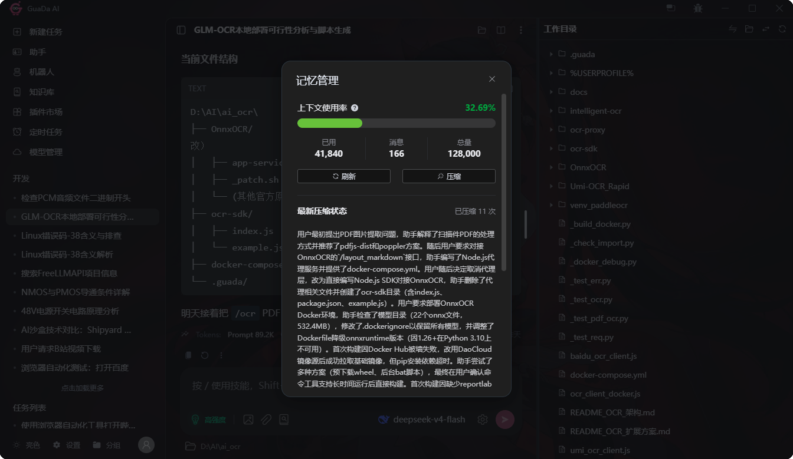
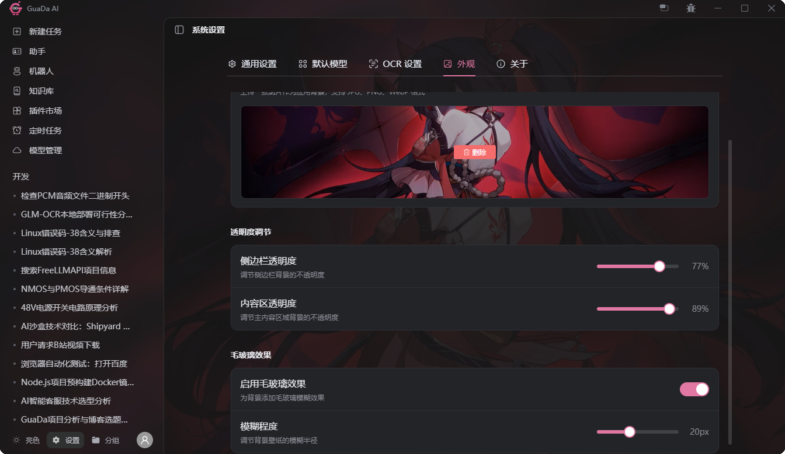

# GuaDa — 桌面 AI 工作站

> 看得见、摸得着、能动手的桌面 AI 工作站。基于 ReAct Agent，集成浏览器自动化、RAG 知识库、IM 机器人、MCP 工具与 Skills 技能框架，一个引擎统一服务 Web / 桌面 / IM 三大入口。**目前处于早期开发阶段，部分功能正在持续快速迭代中。**

[](https://nestjs.com)
[](https://vuejs.org)
[](https://www.typescriptlang.org)
[](https://www.prisma.io)
[](LICENSE)

中文 | [English](README.en.md)

---

## 项目仓库

- **GitHub**: https://github.com/donggua-zen/guada
- **Gitee**: https://gitee.com/zhendongdong/guada_ai

---

遇到问题、意见建议、技术交流或者下载预编译的客户端请加：
- QQ群：1047993501
- 公众号：冬瓜编程实验室

## 目录

- [能用来干嘛？](#能用来干嘛)
- [适用人群 & 为什么选择 GuaDa](#适用人群--为什么选择-guada)
- [核心优势](#核心优势)
- [整体架构](#整体架构)
- [核心引擎](#核心引擎)
  - [Agent 对话引擎](#agent-对话引擎)
  - [上下文管理与压缩](#上下文管理与压缩)
- [知识库 (RAG)](#知识库-rag)
- [Skills 技能框架](#skills-技能框架)
- [Bot 网关](#bot-网关)
- [定时任务](#定时任务)
- [浏览器自动化](#浏览器自动化)
- [多模型管理](#多模型管理)
- [技术栈](#技术栈)
- [开发计划](#开发计划)
- [快速开始](#快速开始)
- [项目结构](#项目结构)
- [许可证](#许可证)

---

## 能用来干嘛？

### ✅ 适合的场景

| 场景 | 说明 |
|------|------|
| **对话问答** | 日常聊天、答疑解惑、信息查询，支持多模型切换 |
| **私人知识库** | 上传 PDF / 文档，AI 基于你的资料回答问题，数据不出本机 |
| **智能客服** | 接入 QQ / 企业微信，绑定知识库，客户发消息 AI 自动回复，24 小时在线 |
| **办公自动化** | 数据分析、文档翻译、会议纪要、邮件撰写，桌面端随开随用 |
| **浏览器自动化** | "帮我把这个网页的数据爬下来"、"每天截图后台状态"、"给 B 站热门视频自动投币"——Agent 直接操控浏览器 |
| **创意创作** | 小说写作、文案策划、剧本创作、头脑风暴 |
| **生产力工具** | 项目架构分析、代码审查、技术方案评估 |

### ❌ 不适合的场景

| 场景 | 建议 |
|------|------|
| **大型项目编码** | 请使用 Claude Code、Cursor 等专业编码 Agent |
| **视频 / 短剧生成** | 可用 GuaDa 进行剧本和分镜创作，再导入即梦、Sora 等专业平台生成，效果最佳 |

---

## 适用人群 & 为什么选择 GuaDa

### 适合谁用？

| 人群 | 典型场景 |
|------|---------|
| **个人开发者 / 极客** | 本地部署私人 AI 助手，自定义技能和知识库，数据不出本机 |
| **企业团队** | 搭建内部 AI 中台，对接 IM 做智能客服，私有化部署保障数据安全 |
| **AI 产品爱好者** | 一站式体验 Agent 自治循环、RAG 检索、MCP 协议、Skills 框架等前沿技术 |

> **一句话总结**：桌面 AI 工作站。浏览器自动化 + 知识库 + IM 机器⼈ + 技能框架，一个引擎统一服务 Web / 桌面 / IM 三大入口，轻量私有，开箱即用。

---

## 核心优势

| 能力 | 核心亮点 |
|------|---------|
| **智能体（Agent）** | 基于 ReAct 模式的多轮自治循环，可自主调度知识检索、工具执行、技能调用，支持会话锁、流式传输、中断处理与再生模式 |
| **知识库** | 语义+关键词双重匹配搜索（sqlite-vec + FTS5 + jieba + BM25），目录层级管理，Agent 自主多轮搜索与自助添加文档 |
| **机器人** | 支持 QQ、企业微信等 IM 平台统一接入，配合知识库搭建智能客服，支持自动重连、消息合并与会话映射 |
| **长期记忆** | 对话记忆持久化，两级压缩策略（优先裁剪工具结果再语义压缩），检查点持久化与压缩回退，最近 5 条/最新 3 条保护机制 |
| **技能管理** | 文件即技能，人人可编写分享。支持热插拔（改完即生效），兼容庞大的 Skills 市场生态 |
| **多部署方式** | 支持 Electron 桌面端、Web 应用、Docker 容器化三种部署方式 |
| **企业级数据支持** | 默认 SQLite，通过 Prisma ORM 可无缝切换 MySQL、PostgreSQL |
| **定时任务** | Agent 按周期自动执行，支持 Cron 表达式与固定间隔，角色继承与会话隔离，完整执行记录 |
| **浏览器自动化** | Electron 内嵌 Chromium，Agent 可直接操控浏览器。经智能压缩优化，保留整体页面架构的同时大幅降低 Token 消耗，AI 既看清全局又省成本 |
| **多模型管理** | 统一接入 OpenAI、Anthropic、Azure、Google 等主流 LLM，支持动态切换与层级模型配置 |
| **自定义壁纸** | 自定义背景壁纸、透明度、毛玻璃效果，打造个性化工作站 |

### 产品截图

|  |  |
|:---:|:---:|
|  |  |
|  |  |
|  |  |

---

## 整体架构


### 架构层次介绍

| 层级 | 职责 | 核心组件 |
|------|------|----------|
| **前端入口** | 用户交互层,提供三种访问方式:Web 应用、Electron 桌面应用、IM 平台客户端 | Vue 3 Web 端、Electron 桌面应用、QQ/飞书/企业微信等 IM 平台 |
| **入口层** | 请求处理与路由分发,将不同来源的请求统一转换为内部协议 | REST + SSE API(面向 Web/Electron)、Bot Gateway(面向 IM 平台) |
| **核心服务层** | 业务逻辑中枢,由 Agent Engine 统一调度对话、知识检索、工具调用等能力 | Agent Engine、上下文压缩、知识库 RAG、工具与 MCP、Skills 框架、LLM 适配器 |
| **数据层** | 持久化存储基础设施,管理关系型数据、向量索引和文件资源 | SQLite(Prisma)、sqlite-vec + FTS5、文件系统存储 |

---

## 核心引擎

### Agent 对话引擎

GuaDa 的核心是一个实现了 **ReAct (Reasoning + Acting) 模式** 的多轮自治循环引擎：

**关键设计**：

| 机制 | 说明 |
|------|------|
| **会话锁 (Session Lock)** | 基于内存 Map 的排他锁，同一会话同时仅处理一个请求，防止并发冲突 |
| **流式传输 (SSE)** | 异步生成器逐块产出事件，前端实时渲染文本、思维链、工具调用进度 |
| **ReAct 循环** | LLM 推理 → 工具调用 → 结果注入 → 再度推理 |
| **中断处理** | `AbortSignal` 传递至 LLM 请求层，客户端断开时自动中止，节省 Token 成本 |
| **再生模式** | 支持 `overwrite`（覆盖）和 `multi_version`（多版本并存）两种消息重生策略 |
| **思考追踪** | 记录推理开始/结束时间戳，计算思维链耗时，存储于消息元数据中 |

---

### 上下文管理与压缩

采用 **两级压缩策略**（优先裁剪工具结果→再语义压缩），在 Token 限制与信息保真之间取得平衡。

与传统方案不同，GuaDa 的压缩**非破坏性、可逆**：

- **可编辑**：AI 生成的摘要不准确时，可手动修改内容
- **可回退**：删除任意压缩记录，自动还原对应历史消息，对话回到压缩前状态
- **有历史**：所有压缩记录可见，支持回溯查看每次压缩详情
- **保护机制**：最近 5 条消息强制保留，最新 3 条工具结果免于裁剪

| 模式 | 说明 |
|------|------|
| **丢弃** | 直接丢弃旧消息，最快但丢失历史 |
| **快速压缩** | 单次 LLM 调用生成摘要，效率优先 |
| **迭代压缩** | Agent 自检优化（最多 3 轮），质量最高，默认使用 |

默认 `iterative`，失败自动回退到 `fast`。

---

## 知识库 (RAG)

完整的 **检索增强生成 (RAG)** 流程。→ [详细文档](docs/knowledge-base.md)

**核心亮点 — Agent 自助管理**（区别于常规 RAG）：

- **自助多轮搜索**：Agent 自主决定搜索策略、轮次和文件组合，而非系统预先排序
- **自助写入**：Agent 读取本地文件后自动解析、分块、向量化并存入知识库

**文档处理**：PDF/DOCX/TXT 等 40+ 格式 → Token 智能分块 → 向量嵌入，异步处理自动恢复中断

**混合检索**：语义搜索（sqlite-vec）+ 关键词搜索（FTS5 + jieba + BM25）加权融合，权重可配置，支持文件过滤与分区存储

**文件管理**：层级目录结构，支持创建文件夹、批量上传、移动、重命名

---

## Skills 技能框架

基于 **Anthropic Skills 协议** 设计，以文件系统为存储。技能就是一个 Markdown 文件 + 可选脚本，人人都能编写和分享。

**核心优势**：

- **渐进式加载**：L1 元数据注入 System Prompt，Agent 按需激活完整指令，避免一次性消耗大量 Token
- **热插拔**：新增、修改或删除技能即时生效，无需重启系统
- **Agent 原生调度**：技能注册为 `skill__` 命名空间工具，Agent 在 ReAct 循环中按需调用

---

## Bot 网关

Bot 网关将 AI 对话能力扩展到即时通讯平台，通过统一的适配接口实现多平台无缝接入。


- **统一适配接口 (`IBotPlatform`)**：策略模式设计，新平台接入只需实现接口
- **自动重连**：WebSocket 断连后指数退避重试
- **消息合并**：1.5 秒窗口内多条消息合并为一条处理
- **会话映射**：通过 `(platform, type, nativeId)` 三元组建立外部用户到内部 Session 的映射
- **生命周期管理**：支持动态启动、停止、重启机器人实例

---

## 定时任务

系统内置定时任务调度能力，Agent 可按配置周期自动执行对话任务：

- **周期配置**：支持 Cron 表达式与固定间隔两种调度方式
- **角色继承**：定时任务可绑定特定角色，复用已有会话配置与模型参数
- **会话隔离**：每个定时任务拥有独立会话上下文，避免与人工对话冲突
- **执行记录**：完整记录每次执行结果与日志，便于审计与排查

---

## 浏览器自动化

Electron 桌面端内嵌 Chromium 浏览器引擎，Agent 可直接操控浏览器：

- **页面操控**：点击、输入、滚动、截图等常见操作
- **数据采集**：提取页面元素、表格、文本内容
- **多标签管理**：支持同时打开多个标签页并切换上下文
- **与 Agent 集成**：浏览器操作作为工具调用链路的一环，结果直接注入对话上下文

---

## 多模型管理

统一 LLM 适配层，灵活接入多种模型供应商：

- **供应商抽象**：通过 `LLMProvider` 接口统一封装不同供应商的 API 差异
- **动态切换**：角色级、会话级、全局级多层级模型配置
- **Thinking 配置**：支持推理强度控制与专用压缩模型配置
- **Token 精准计数**：使用 `@huggingface/tokenizers` 进行精准 Token 计数，避免字符预估误差


## 技术栈

| 层级 | 技术选型 |
|------|---------|
| **后端框架** | NestJS 11 + TypeScript |
| **前端框架** | Vue 3 + TypeScript |
| **桌面端** | Electron |
| **数据库** | SQLite（默认，Prisma ORM），可切换 MySQL / PostgreSQL |
| **向量检索** | sqlite-vec + FTS5 全文检索 + jieba 分词 + BM25 重排序 |
| **AI 模型** | OpenAI / Anthropic / Azure / Google 等主流 LLM |
| **容器化** | Docker + Docker Compose |
| **反向代理** | Nginx |

---

## 快速开始

### 环境要求

- Node.js ≥ 18.x （推荐 20.x LTS）
- npm ≥ 9.x

### 启动后端

```bash
cd backend-ts
npm install              # 自动执行 prisma generate
npm run db:seed:force    # 初始化种子数据（默认账户 guada / guada）
npm run start:dev        # 开发模式启动 → http://localhost:3000
```

### 启动前端

```bash
cd frontend
npm install
npm run dev              # 开发模式启动 → http://localhost:5173
```

### 生产环境部署

#### Docker 部署（推荐）
详细的 Docker 容器化部署指南请查看：[Docker 部署文档](docs/DOCKER_DEPLOYMENT.md)

快速开始：
```bash
# 1. 配置环境变量（文件位于 backend-ts 目录下）
cp backend-ts/.env.example backend-ts/.env
# 编辑 backend-ts/.env 文件，修改 JWT_SECRET

# 2. 一键部署
chmod +x deploy.sh
./deploy.sh

# 3. 访问应用
# 前端: http://localhost:8787 （如无法访问，尝试 http://127.0.0.1:8787）
# 后端 API: http://localhost:8787/api/v1 （通过 Nginx 代理）
# 注意：默认配置下后端端口不暴露，如需调试请参考 Docker 部署文档
```

优势：
- ✅ 一键部署，无需手动安装依赖
- ✅ 环境隔离，避免依赖冲突
- ✅ 自动健康检查和重启
- ✅ 数据持久化，升级不丢失
- ✅ 资源限制，防止内存泄漏

#### Web 版本（传统部署）
详细的生产环境部署指南请查看：[生产环境部署文档](docs/PRODUCTION_DEPLOYMENT.md)

主要步骤包括：
1. 配置环境变量（复制 `.env.example` 为 `.env`）
2. 构建生产版本（`npm run build`）
3. 使用 PM2 进程守护
4. 配置 Nginx 反向代理
5. 设置 HTTPS 证书

#### Electron 版本
详细的 Electron 部署指南请查看：[Electron 部署文档](docs/ELECTRON_DEPLOYMENT.md)

主要内容包括：
1. 开发环境搭建
2. 生产构建与打包
3. 数据持久化与备份
4. 故障排查与日志查看
5. 更新与升级

### 常见问题

遇到问题请查看：[故障排查指南](docs/TROUBLESHOOTING.md)

常见问题包括：
- 数据库表不存在
- Prisma Client 未生成
- 端口冲突
- 环境变量配置错误
- 权限问题

---

## 项目结构

```
ai_chat/
├── backend-ts/                  # NestJS 后端
│   ├── prisma/
│   │   └── schema.prisma        # 数据库 Schema
│   ├── src/
│   │   ├── common/              # 基础设施 (database, vector-db, mcp, utils 等)
│   │   ├── modules/
│   │   │   ├── chat/            # 核心对话模块 (Agent引擎、压缩、上下文、消息)
│   │   │   ├── tools/           # 工具调用系统
│   │   │   ├── skills/          # Skills 技能框架
│   │   │   ├── knowledge-base/  # 知识库模块 (RAG)
│   │   │   ├── llm-core/        # LLM 适配层
│   │   │   ├── bot-gateway/     # 多平台机器人网关
│   │   │   ├── characters/      # 角色管理
│   │   │   ├── files/           # 文件管理
│   │   │   ├── mcp-servers/     # MCP 服务器管理
│   │   │   ├── auth/            # JWT 认证
│   │   │   ├── models/          # 模型管理
│   │   │   ├── settings/        # 系统设置
│   │   │   └── users/           # 用户管理
│   │   └── main.ts              # 应用入口
│   └── skills/                  # Skills 技能目录
├── frontend/                    # Vue 3 前端
│   ├── src/
│   │   ├── components/          # 组件 (chat, knowledge-base, plugins, bot, setting 等)
│   │   ├── composables/         # 组合式函数
│   │   ├── stores/              # Pinia 状态管理
│   │   ├── services/            # API 服务层
│   │   ├── types/               # TypeScript 类型定义
│   │   └── utils/               # 工具函数
│   └── package.json
├── electron/                    # Electron 桌面端
├── docs/                        # 项目文档
└── LICENSE
```

---

## 开发计划

| 功能 | 状态 | 说明 |
|------|------|------|
| **Agent 工作流** | 📝 规划中 | 多步骤 Agent 编排与子 Agent 协作 |
| **子 Agent** | 📝 规划中 | 分层 Agent 体系，复杂任务拆解分发 |
| **沙箱** | 📝 规划中 | 安全的代码执行环境，Agent 可编写并运行脚本 |
| **子账户** | 🔧 后端已完成 | 数据隔离、配置共享，适合家庭 / 团队共享使用 |

---

## 许可证

本项目基于 [MIT License](LICENSE) 开源。

---
